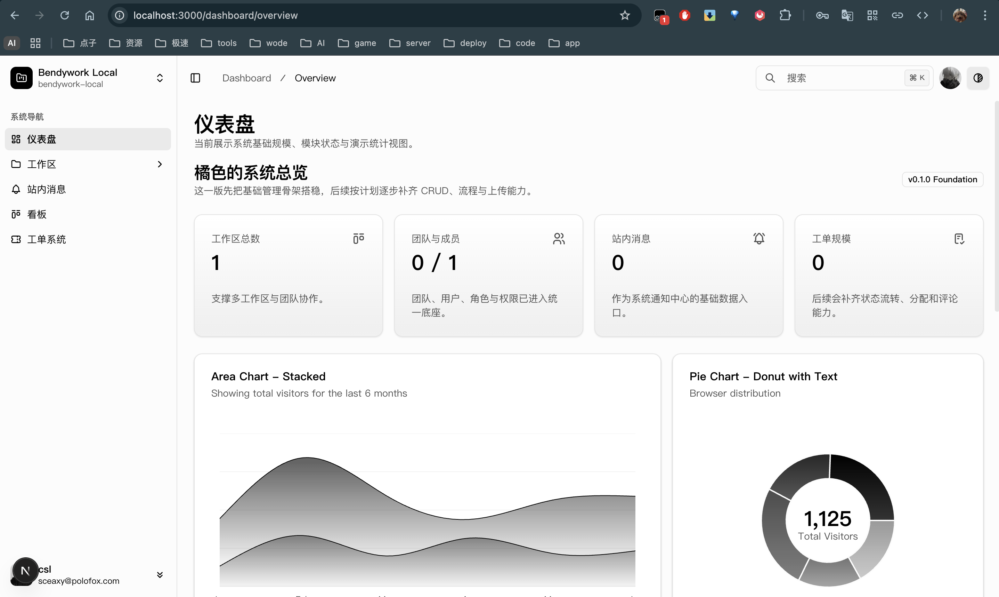
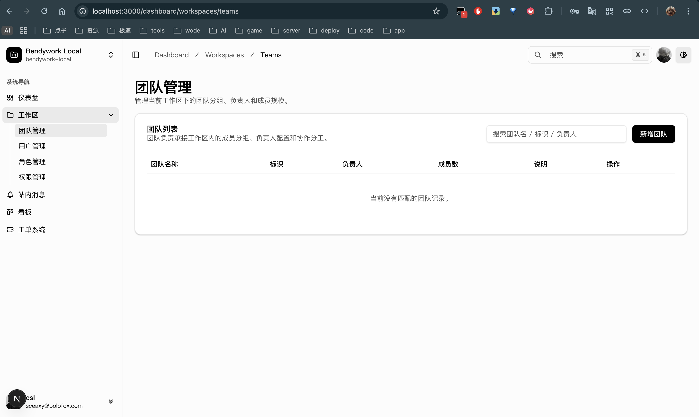
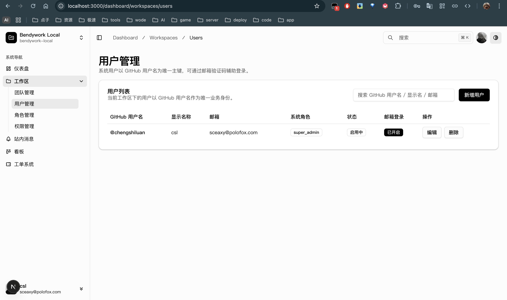
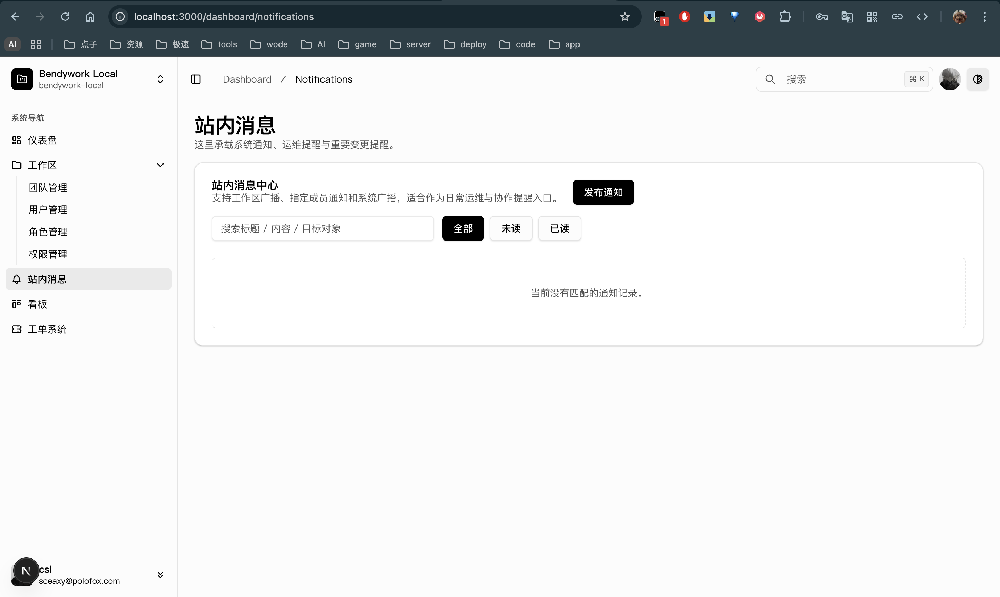
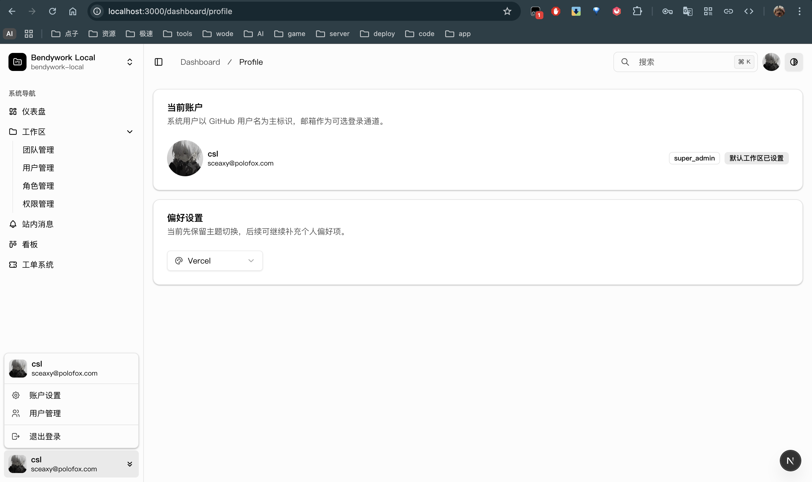

# Bendywork Info Base

<p align='center'>
  
  
  
  
  
</p>

一个面向真实业务后台场景的 Next.js 管理系统底座，基于 `Next.js 16`、`NextAuth.js`、`Drizzle ORM`、`Neon PostgreSQL`、`Upstash Redis`、`Tailwind CSS v4` 构建。

> 目标：先把登录、工作区、团队、用户、角色、权限、通知、工单、看板、文件上传这些后台基础设施搭稳，再在这套骨架上持续做业务化迭代，而不是每次从零拼装。

## 项目图

### 当前预览



| 登录与概览 | 管理后台 |
| --- | --- |
|  |  |
|  |  |

上面这组图已经直接接入 README 预览。如果你后面要继续补素材，建议统一放到 `docs/images/` 或 `public/project/`，不要混用大小写路径。

### 建议继续补的素材

- README 主图：`1600 x 900`
- 模块截图：`1440 x 900`
- 所有截图统一浅色主题、统一浏览器窗口边框、统一中文数据

- `docs/images/hero-dashboard.png`
  - 用途：README 首屏主图，建议展示登录后后台首页或概览页
- `docs/images/auth-sign-in.png`
  - 用途：认证页截图，展示 GitHub 登录 / 邮箱验证码登录入口
- `docs/images/workspaces-management.png`
  - 用途：工作区、团队、用户、角色、权限管理页
- `docs/images/notifications-tickets.png`
  - 用途：通知中心、工单列表或工单详情页
- `docs/images/ticket-kanban.png`
  - 用途：看板页或工单状态流转页

如果你后面把图片改到 `docs/images/`，可以直接把当前预览区的路径替换成下面这种形式：

```md

```

## 这个项目是什么

`Bendywork Info Base` 不是通用演示模板，而是一套已经切换到 Bendywork 业务语义的后台基础盘。

它当前重点覆盖的是：

- 仅授权用户可登录的后台入口
- 工作区与成员归属体系
- 团队、用户、角色、权限的基础管理链路
- 通知中心、工单系统、看板页基础能力
- 适合部署到 Vercel 的现代 Next.js 全栈结构

它明确不做的事情包括：

- 对外开放注册
- 传统用户名 / 密码账户体系
- 旧模板里的组织计费、无关营销页、演示型第三方集成

## 当前能力

### 已完成

- `GitHub OAuth` 登录
- `邮箱验证码登录` 基础链路
- `NextAuth.js` 会话体系与后台路由保护
- `Neon PostgreSQL + Drizzle ORM` 基础设施
- `Upstash Redis` 验证码存储
- `S3-compatible storage` 接口与能力预留
- 工作区、团队、用户、角色、权限、通知、工单、审计日志等核心表结构
- 工作区管理 CRUD
- 团队 / 用户 / 角色 / 权限 / 通知 / 工单管理页基础读写链路
- 看板页骨架与工单状态展示
- 数据库缺失时的部分演示数据回退能力

### 正在补强

- Node 24 / ESLint / 本地工程质量对齐
- 管理端关键流程最小验证清单
- 通知、工单、上传、审计的深度业务联动

详细路线图见 [Plan.md](./Plan.md)，版本记录见 [CHANGELOG.md](./CHANGELOG.md)。

## 技术栈

| 类别 | 方案 |
| --- | --- |
| 框架 | Next.js 16 (App Router) |
| UI | React 19, Tailwind CSS v4, shadcn/ui, Radix UI |
| 语言 | TypeScript 5.7 |
| 认证 | NextAuth.js, GitHub OAuth, Email Code |
| 数据库 | Neon PostgreSQL |
| ORM | Drizzle ORM + drizzle-kit |
| 缓存 / 短期状态 | Upstash Redis |
| 文件存储 | S3-compatible storage scaffold |
| 表单 / 校验 | React Hook Form + Zod |
| 表格 / 图表 | TanStack Table, Recharts |
| 全局状态 | Zustand |
| 部署建议 | Vercel |

## 认证与基础设施配置（先配这个）

这个项目的登录方式只有两种：

- `GitHub OAuth`
- `邮箱验证码登录`

系统不开放注册。用户必须先存在于 `users` 表中，才能成功进入后台。

### 1. 先建 GitHub OAuth App，不是 GitHub App

当前代码使用的是 `NextAuth.js GitHub Provider`，因此你需要创建的是 **GitHub OAuth App**，不是 GitHub App。

建议这样填写：

- Homepage URL
  - 本地：`http://localhost:3000`
  - 生产：`https://your-domain.com`
- Authorization callback URL
  - 本地：`http://localhost:3000/api/auth/callback/github`
  - 生产：`https://your-domain.com/api/auth/callback/github`

创建完成后，把 GitHub 提供的：

- `Client ID` 填到 `GITHUB_ID`
- `Client Secret` 填到 `GITHUB_SECRET`

### 2. 环境变量说明

复制环境模板：

```bash
cp env.example.txt .env.local
```

核心变量如下：

| 变量名 | 本地是否必须 | 生产是否必须 | 说明 |
| --- | --- | --- | --- |
| `NEXT_PUBLIC_APP_NAME` | 否 | 否 | 前端展示用应用名 |
| `NEXT_PUBLIC_APP_URL` | 建议 | 建议 | 前端显式使用的站点 URL |
| `NEXTAUTH_URL` | 是 | 是 | NextAuth 回调与会话基准地址 |
| `NEXTAUTH_SECRET` | 是 | 是 | 会话加密密钥，建议至少 32 位 |
| `GITHUB_ID` | GitHub 登录必填 | GitHub 登录必填 | GitHub OAuth App Client ID |
| `GITHUB_SECRET` | GitHub 登录必填 | GitHub 登录必填 | GitHub OAuth App Client Secret |
| `DATABASE_URL` | 是 | 是 | PostgreSQL 连接串，推荐 Neon |
| `UPSTASH_REDIS_REST_URL` | 邮箱登录必填 | 邮箱登录必填 | 验证码存储 |
| `UPSTASH_REDIS_REST_TOKEN` | 邮箱登录必填 | 邮箱登录必填 | Redis 鉴权 Token |
| `RESEND_API_KEY` | 否 | 邮箱登录强烈建议 | 邮件发送服务 |
| `EMAIL_FROM` | 否 | 邮箱登录强烈建议 | 当前代码要求填写纯邮箱地址，如 `noreply@example.com` |
| `S3_REGION` | 否 | 否 | 预留的对象存储区域 |
| `S3_BUCKET` | 否 | 否 | 预留的对象存储 Bucket |
| `S3_ENDPOINT` | 否 | 否 | 预留的 S3 兼容 Endpoint |
| `S3_ACCESS_KEY_ID` | 否 | 否 | 预留的对象存储 Access Key |
| `S3_SECRET_ACCESS_KEY` | 否 | 否 | 预留的对象存储 Secret Key |
| `S3_PUBLIC_BASE_URL` | 否 | 否 | 预留的公开访问地址 |
| `NEXT_PUBLIC_ENABLE_GITHUB_LOGIN` | 否 | 否 | 显式关闭 GitHub 登录入口 |
| `NEXT_PUBLIC_ENABLE_EMAIL_LOGIN` | 否 | 否 | 显式关闭邮箱验证码登录入口 |

说明：

- `NEXTAUTH_URL` 必须和你当前实际访问的端口一致。
- 如果本地不是 `3000`，而是 `3001` 或其他端口，GitHub OAuth 回调地址也要同步改掉。
- S3 相关变量可以先不填，空值现在会被当成“未配置”处理，不会阻断启动。

### 3. 数据库初始化

首次建库：

```bash
npm run db:push
```

如果空库首次执行时需要自动确认，也可以使用：

```bash
npx drizzle-kit push --force
```

数据库 Schema 位于 [src/lib/db/schema.ts](./src/lib/db/schema.ts)。

### 4. 初始化管理员

系统不开放注册，所以至少要先创建一个可以登录的后台管理员。

最小示例：

```sql
insert into users (
  github_username,
  email,
  display_name,
  system_role,
  status,
  email_login_enabled
)
values (
  'your_github_username',
  'admin@example.com',
  'Your Admin',
  'super_admin',
  'active',
  true
);
```

如果该用户还需要默认进入某个工作区，再追加：

```sql
insert into workspace_members (workspace_id, user_id, is_owner)
select 'your-workspace-id', id, true
from users
where github_username = 'your_github_username';
```

仓库里也提供了一份可改造的示例脚本：

- [docs/local-bootstrap.sql](./docs/local-bootstrap.sql)

### 5. 邮箱验证码登录说明

邮箱验证码登录依赖：

- `Upstash Redis`
- 可选的 `Resend`

行为规则：

- 未配置 Redis：邮箱验证码登录不可用
- 已配置 Redis、未配置邮件服务：开发环境会返回 `devCode` 方便联调
- 生产环境建议补齐真实邮件服务，不建议依赖开发降级逻辑

### 6. S3 与文件上传

当前仓库已经预留：

- S3 客户端封装
- 上传接口
- 文件资产数据表

但它目前仍属于“能力底座已接好、业务页面待深度接入”的阶段。适合后续继续扩展：

- 工单附件
- 评论附件
- 工作区文件
- 头像缓存
- 富文本资源

## 快速开始

### 1. 切到正确的 Node 版本

```bash
nvm use 24.11.0
```

项目 `package.json` 要求 `Node 24.x`。如果你仍在 Node 16，`lint` 等命令会因为运行时能力缺失而报错。

### 2. 安装依赖

```bash
npm install
```

或

```bash
bun install
```

### 3. 配置环境变量

```bash
cp env.example.txt .env.local
```

至少先补齐：

- `NEXTAUTH_URL`
- `NEXTAUTH_SECRET`
- `GITHUB_ID`
- `GITHUB_SECRET`
- `DATABASE_URL`

如果你要用邮箱验证码登录，再补：

- `UPSTASH_REDIS_REST_URL`
- `UPSTASH_REDIS_REST_TOKEN`
- `RESEND_API_KEY`
- `EMAIL_FROM`

### 4. 初始化数据库

```bash
npm run db:push
```

### 5. 录入管理员

执行你自己的管理员初始化 SQL，确保 GitHub 用户名已经录入，并且 `status='active'`。

### 6. 启动开发环境

```bash
npm run dev
```

默认打开：

- `http://localhost:3000/auth/sign-in`

### 7. 验证是否成功

建议按这个顺序验证：

1. 打开登录页
2. 点击 GitHub 登录
3. 成功进入 `/dashboard/overview`
4. 检查工作区切换器是否有默认工作区
5. 打开工作区、用户、角色、权限、通知、工单页，确认读链路可用

## Vercel 部署指南

### 1. 推荐部署顺序

1. 创建 GitHub OAuth App
2. 创建 Neon PostgreSQL 数据库
3. 创建 Upstash Redis
4. 创建 Resend 邮件服务
5. 在 Vercel 项目中录入环境变量
6. 首次上线前执行 `npm run db:push`
7. 发布后用已录入的 GitHub 管理员账号走通登录

### 2. Vercel 环境变量建议

至少在 `Production` / `Preview` / `Development` 中同步：

- `NEXTAUTH_URL`
- `NEXTAUTH_SECRET`
- `GITHUB_ID`
- `GITHUB_SECRET`
- `DATABASE_URL`

如果启用邮箱验证码登录，再同步：

- `UPSTASH_REDIS_REST_URL`
- `UPSTASH_REDIS_REST_TOKEN`
- `RESEND_API_KEY`
- `EMAIL_FROM`

如果接入文件上传，再同步：

- `S3_REGION`
- `S3_BUCKET`
- `S3_ENDPOINT`
- `S3_ACCESS_KEY_ID`
- `S3_SECRET_ACCESS_KEY`
- `S3_PUBLIC_BASE_URL`

### 3. 生产环境注意事项

- 生产环境 `NEXTAUTH_URL` 必须填正式域名
- GitHub OAuth App 的回调地址必须改为正式域名
- 不建议在生产环境依赖开发态 `devCode`
- 生产变更 Schema 前，先确认兼容性与回滚策略

## 功能清单

### 认证与会话

- GitHub OAuth 登录
- 邮箱验证码登录
- 无开放注册
- 已登录用户访问 `/auth/*` 自动跳转后台
- 未登录用户访问 `/dashboard/*` 自动跳转登录页

### 工作区与组织能力

- 工作区列表
- 工作区新增、编辑、归档
- 工作区切换与 cookie 持久化
- 非 `super_admin` 仅可见自身归属工作区

### 管理后台模块

- 团队管理
- 用户管理
- 角色管理
- 权限管理
- 通知管理
- 工单管理
- 工单看板
- 审计日志 API

### 平台基础设施

- Drizzle ORM Schema
- 管理写入唯一性校验
- 关联数据写入前校验
- Demo data fallback
- S3 上传接口预留
- 文件资产表与审计日志表

## 目录结构

```text
src/
  app/
    api/                          # Route Handlers
    auth/                         # 登录相关页面
    dashboard/                    # 后台页面
  components/
    layout/                       # Sidebar / Header / Shell
    themes/                       # 多主题支持
    ui/                           # shadcn/ui 组件
  features/
    auth/                         # 认证页面组件
    management/                   # 工作区 / 用户 / 角色 / 权限 / 通知 / 工单
    overview/                     # 仪表盘
    kanban/                       # 看板
    profile/                      # 用户资料
  lib/
    auth/                         # 会话、验证码、API guard
    db/                           # Drizzle 数据库入口与 Schema
    platform/                     # 服务层、写入、校验、演示数据
    storage/                      # S3 封装
  styles/
    themes/                       # 主题 CSS
docs/
  auth-infra.md                   # 认证与基础设施说明
  nav-rbac.md                     # 权限与导航说明
Plan.md                           # 路线图
maintain.md                       # 维护手册
CHANGELOG.md                      # 版本记录
```

## 数据模型概要

当前核心表包括：

- `users`
  - 平台用户，主身份为 `github_username`
- `workspaces`
  - 工作区信息
- `workspace_members`
  - 用户与工作区归属关系
- `teams`
  - 工作区内团队
- `roles`
  - 工作区角色
- `permissions`
  - 权限码定义
- `role_permissions`
  - 角色与权限绑定
- `team_members`
  - 团队成员关系
- `notifications`
  - 通知中心数据
- `tickets`
  - 工单主体
- `ticket_comments`
  - 工单评论
- `file_assets`
  - 文件资产与附件元数据
- `audit_logs`
  - 操作审计记录

Schema 入口：

- [src/lib/db/schema.ts](./src/lib/db/schema.ts)

## 项目状态与路线图

### 当前版本

- `0.1.0`

### 当前阶段

- 已从原始模板切换为 Bendywork 业务基线
- 已完成认证、数据库、基础管理后台骨架
- 正在做工程质量补强与业务联动深化

### 接下来优先事项

- 恢复 `lint` 与 Node 24 开发一致性
- 完整补齐管理端最小验证清单
- 深化通知中心与工单状态流转
- 将文件上传真正接入工单 / 评论
- 增强审计日志与活动流

更详细的迭代计划见：

- [Plan.md](./Plan.md)
- [CHANGELOG.md](./CHANGELOG.md)
- [maintain.md](./maintain.md)

## 文档索引

- [docs/auth-infra.md](./docs/auth-infra.md)
  - 认证、数据库、Redis、邮件与部署基础说明
- [docs/nav-rbac.md](./docs/nav-rbac.md)
  - 导航与权限模型说明
- [Plan.md](./Plan.md)
  - 后续路线图
- [maintain.md](./maintain.md)
  - 启动、维护、发布、排障手册
- [CHANGELOG.md](./CHANGELOG.md)
  - 版本更新记录

## 说明

- 这个项目的“菜单权限过滤”目前主要服务于 UX；真正的安全控制仍应以服务端校验为准。
- 数据库未配置时，部分读页面会回退到演示数据，方便继续做 UI 和流程迭代；但登录与真实写入依赖数据库。
- 当前仓库更适合作为“内部后台 / SaaS 后台 / 团队管理后台”的业务起点，而不是纯展示模板。

## 致谢

本项目最初基于一个 MIT 许可的 Next.js Dashboard Starter 演进而来，后续已按 Bendywork 的业务要求进行了大幅重构与语义收敛。

## License

MIT © Bendywork contributors
